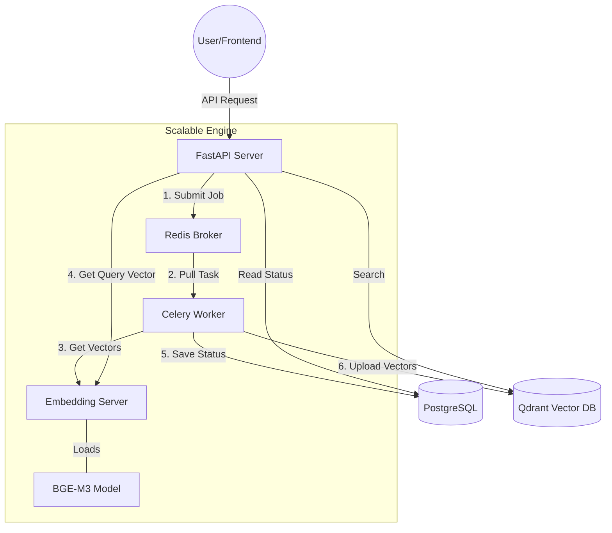
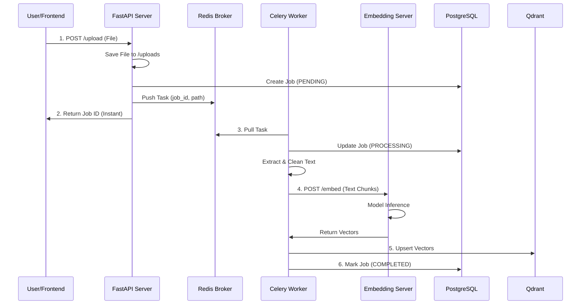
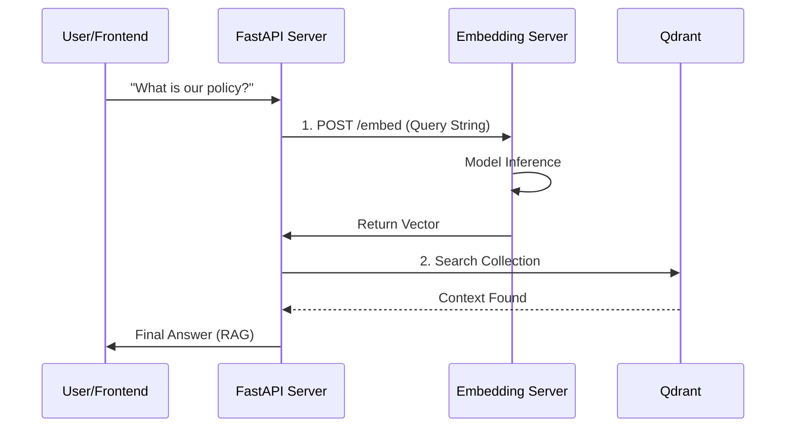

# EcoStance Hybrid RAG Architecture Overview

This document describes the high-performance "Hybrid" architecture implemented to handle large-scale document processing and AI querying while maintaining low RAM usage and high availability.

---

## 1. The Core Components

| Component | Responsibility | Memory Impact |
| :--- | :--- | :--- |
| **Main API (FastAPI)** | Handles web requests, user auth, and job submission. | **Low** (~150MB) |
| **Embedding Server** | The "Model Owner." Loads BGE-M3 and performs all math. | **High** (~2.5GB) |
| **Celery Worker** | Background processor. Handles extraction, cleaning, and chunking. | **Low** (~200MB) |
| **Redis** | The traffic controller (Message Broker) for background tasks. | **Very Low** |
| **PostgreSQL & Qdrant** | Relational and Vector storage. | External |

---

## 2. Architecture Diagram

---

## 3. Sequence Diagrams

### A. Document Upload & Background Processing
This diagram shows how work is offloaded to the background to prevent UI timeouts.

### B. Real-time Querying (RAG)
This diagram shows how the light API worker gets vectors without loading the model.

---

## 4. How it Works

### A. The "Heavy" Pipeline (Uploading/Processing)
1.  **API Server**: Receives the file, saves it to storage, and creates a "PENDING" entry in PostgreSQL. It returns a `job_id` to the user **instantly**.
2.  **Redis**: Takes a message containing the file path and metadata.
3.  **Celery Worker**: Pulls the message. It extracts text, cleans it (optimized loop), and chunks it.
4.  **Handshake**: The Worker sends the chunks to the **Embedding Server** via an internal HTTP call to get the vectors.
5.  **Completion**: The Worker uploads the vectors to Qdrant and marks the job "COMPLETED" in the DB.

### B. The "Fast" Pipeline (Querying/Chatting)
1.  **User Message**: "What is our policy?"
2.  **API Server**: Does NOT load the model. It sends the query string to the **Embedding Server**.
3.  **Internal Response**: The Embedding Server returns the vector in ~50ms.
4.  **Qdrant Search**: The API Server uses that vector to search Qdrant and returns the final answer to the user.

---

## 4. Crucial Benefits

1.  **Zero Memory Duplication**: Regardless of how many workers or API instances you start, only **one** process loads the heavy BGE-M3 model.
2.  **No More 504 Timeouts**: Because the API returns immediately and offloads math, it is never "frozen" and preserves its heartbeat with the gateway.
3.  **Resilience**: If the AI model crashes or is slow, the Web Server remains alive to provide status updates or retry the job.
4.  **GPU-Ready**: You can put the `Embedding Server` container on a GPU-enabled node while keeping the rest of the app on cheap CPU-only nodes.
