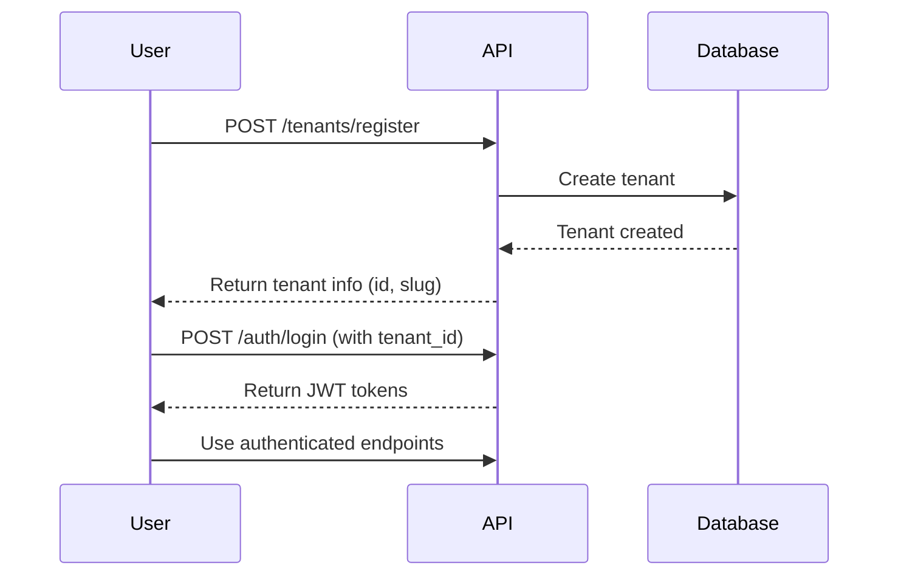
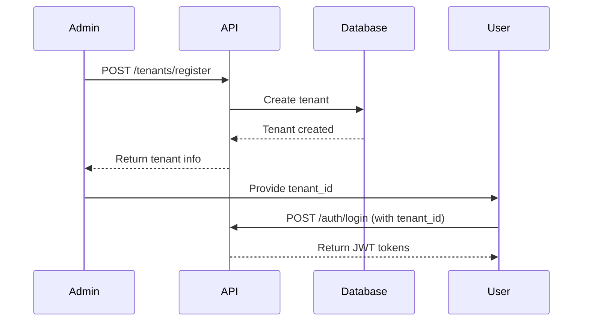
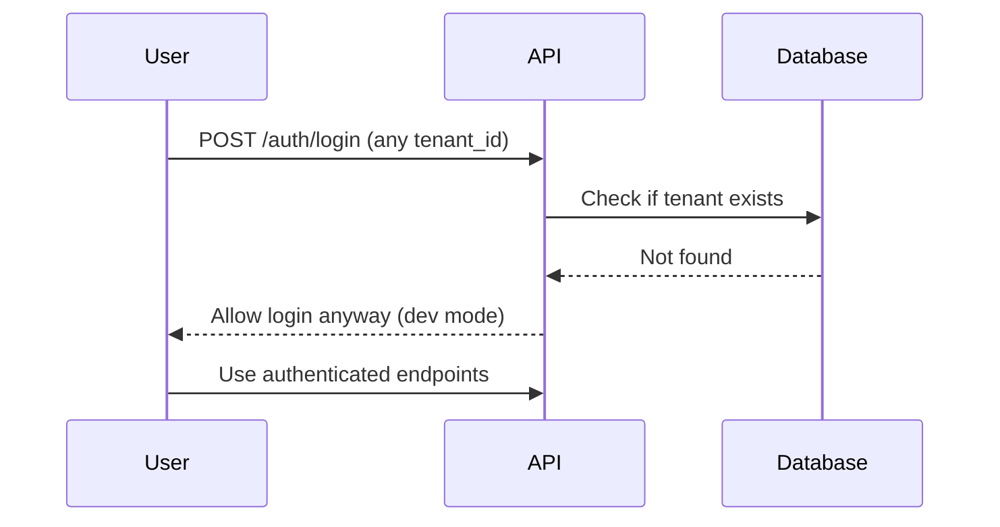

# Tenant Management System

## Overview
The system now includes comprehensive tenant management capabilities for creating, managing, and administering tenant accounts.

## Who Creates Tenants?

### Current Options

#### 1. Self-Service Registration (Recommended for Production)
Users can register their own tenant accounts through the API.

**Endpoint:** `POST /api/v1/tenants/register`

**Example:**
```bash
curl -X POST "http://127.0.0.1:8000/api/v1/tenants/register" \
  -H "Content-Type: application/json" \
  -d '{
    "name": "Acme Corporation",
    "email": "admin@acme.com",
    "phone": "+1-555-0123",
    "billing_tier": "free"
  }'
```

**Response:**
```json
{
  "id": "550e8400-e29b-41d4-a716-446655440000",
  "name": "Acme Corporation",
  "slug": "acme-corporation-a1b2c3",
  "email": "admin@acme.com",
  "phone": "+1-555-0123",
  "is_active": true,
  "created_at": "2024-11-13T10:00:00",
  "billing_tier": "free",
  "billing_status": "active"
}
```

#### 2. Admin Creation
System administrators can create tenants through admin endpoints.

**Endpoint:** `POST /api/v1/tenants/register`

Same as self-service, but typically done through an admin interface.

#### 3. Development Mode (Current)
For development, tenants are created implicitly on first login. The auth endpoint allows any tenant_id and creates a session without requiring the tenant to exist in the database.

**This is NOT recommended for production!**

## Tenant Management Endpoints

### Public Endpoints

#### Register Tenant
```
POST /api/v1/tenants/register
```

Creates a new tenant account. No authentication required.

**Request Body:**
```json
{
  "name": "Company Name",
  "email": "admin@company.com",
  "phone": "+1-555-0123",
  "billing_tier": "free"
}
```

**Billing Tiers:**
- `free` - Free tier with basic limits
- `starter` - Starter plan
- `professional` - Professional plan
- `enterprise` - Enterprise plan

### Authenticated Endpoints

#### Get Current Tenant
```
GET /api/v1/tenants/me
```

Returns information about the currently authenticated tenant.

**Requires:** JWT token in Authorization header

**Response:**
```json
{
  "id": "tenant-uuid",
  "name": "Company Name",
  "slug": "company-name-abc123",
  "email": "admin@company.com",
  "is_active": true,
  "billing_tier": "free",
  "billing_status": "active",
  "created_at": "2024-11-13T10:00:00"
}
```

### Admin Endpoints

#### List All Tenants
```
GET /api/v1/tenants/?skip=0&limit=100
```

Lists all tenants in the system.

**Note:** In production, this should require admin authentication.

#### Get Tenant by ID
```
GET /api/v1/tenants/{tenant_id}
```

Get specific tenant information.

#### Update Tenant
```
PUT /api/v1/tenants/{tenant_id}
```

Update tenant information.

**Request Body:**
```json
{
  "name": "Updated Name",
  "email": "newemail@company.com",
  "is_active": true,
  "billing_tier": "professional",
  "settings": {
    "max_storage_bytes": 21474836480,
    "max_queries_per_day": 5000
  }
}
```

#### Delete Tenant
```
DELETE /api/v1/tenants/{tenant_id}?hard_delete=false
```

Delete a tenant. By default performs soft delete.

**Parameters:**
- `hard_delete=false` - Soft delete (default, can be restored)
- `hard_delete=true` - Permanent deletion

#### Activate Tenant
```
POST /api/v1/tenants/{tenant_id}/activate
```

Activate a deactivated or soft-deleted tenant.

#### Deactivate Tenant
```
POST /api/v1/tenants/{tenant_id}/deactivate
```

Deactivate a tenant account (suspends access).

## Tenant Model

### Database Schema

```python
class Tenant:
    id: str                    # UUID
    name: str                  # Company/Organization name
    slug: str                  # URL-friendly identifier
    email: str                 # Contact email
    phone: str                 # Contact phone
    is_active: bool            # Active status
    created_at: datetime       # Creation timestamp
    updated_at: datetime       # Last update timestamp
    deleted_at: datetime       # Soft delete timestamp
    settings: dict             # Configuration settings
    billing_tier: str          # Billing plan
    billing_status: str        # Billing status
```

### Default Settings

When a tenant is created, they get these default settings:

```json
{
  "max_storage_bytes": 10737418240,    // 10GB
  "max_queries_per_day": 1000,
  "max_queries_per_month": 30000,
  "max_documents": 10000,
  "max_db_connections": 5,
  "features": ["rag", "db_chat"],
  "region": "default"
}
```

### Slug Generation

Tenant slugs are automatically generated from the name:
- Convert to lowercase
- Replace spaces and special characters with hyphens
- Add random 6-character suffix for uniqueness

**Examples:**
- "Acme Corporation" → "acme-corporation-a1b2c3"
- "Tech Startup Inc." → "tech-startup-inc-x7y8z9"

## Usage Workflows

### Workflow 1: Self-Service Registration



### Workflow 2: Admin-Managed



### Workflow 3: Development Mode (Current)



## Python Examples

### Register a New Tenant

```python
import requests

response = requests.post(
    "http://127.0.0.1:8000/api/v1/tenants/register",
    json={
        "name": "My Company",
        "email": "admin@mycompany.com",
        "billing_tier": "free"
    }
)

tenant = response.json()
print(f"Tenant ID: {tenant['id']}")
print(f"Slug: {tenant['slug']}")
```

### Login with Tenant

```python
# Login
response = requests.post(
    "http://127.0.0.1:8000/api/v1/auth/login",
    json={"tenant_id": tenant['id']}
)

tokens = response.json()
access_token = tokens['access_token']

# Use authenticated endpoints
headers = {"Authorization": f"Bearer {access_token}"}

# Get current tenant info
response = requests.get(
    "http://127.0.0.1:8000/api/v1/tenants/me",
    headers=headers
)

print(response.json())
```

### List All Tenants (Admin)

```python
response = requests.get(
    "http://127.0.0.1:8000/api/v1/tenants/",
    params={"skip": 0, "limit": 10}
)

tenants = response.json()
for tenant in tenants:
    print(f"{tenant['name']} ({tenant['slug']})")
```

### Update Tenant

```python
response = requests.put(
    f"http://127.0.0.1:8000/api/v1/tenants/{tenant_id}",
    json={
        "billing_tier": "professional",
        "settings": {
            "max_storage_bytes": 21474836480  # 20GB
        }
    }
)

updated_tenant = response.json()
```

### Deactivate Tenant

```python
response = requests.post(
    f"http://127.0.0.1:8000/api/v1/tenants/{tenant_id}/deactivate"
)

print(response.json())
```

## Security Considerations

### Current Implementation (Development)
- ⚠️ No authentication required for admin endpoints
- ⚠️ Any tenant_id accepted in login
- ⚠️ No email verification
- ⚠️ No rate limiting

### Production Recommendations

#### 1. Add Admin Authentication
```python
from ..auth.dependencies import require_admin

@router.get("/tenants/")
async def list_tenants(
    admin_user = Depends(require_admin),
    db: Session = Depends(get_db)
):
    # Only admins can list all tenants
    ...
```

#### 2. Email Verification
```python
@router.post("/tenants/register")
async def register_tenant(request: TenantCreateRequest):
    # Create tenant with is_active=False
    tenant = Tenant(..., is_active=False)
    
    # Send verification email
    send_verification_email(tenant.email, tenant.id)
    
    return tenant
```

#### 3. Enforce Tenant Existence in Login
```python
@router.post("/auth/login")
async def login(request: LoginRequest, db: Session = Depends(get_db)):
    tenant = db.query(Tenant).filter(Tenant.id == request.tenant_id).first()
    
    if not tenant:
        raise HTTPException(status_code=404, detail="Tenant not found")
    
    if not tenant.is_active:
        raise HTTPException(status_code=403, detail="Tenant inactive")
    
    # Generate tokens
    ...
```

#### 4. Add Rate Limiting
```python
from slowapi import Limiter

limiter = Limiter(key_func=get_remote_address)

@router.post("/tenants/register")
@limiter.limit("5/hour")
async def register_tenant(...):
    ...
```

## Migration from Development to Production

### Step 1: Run Database Migrations
```bash
python migrations/run_migrations.py migrate
```

### Step 2: Create Initial Tenants
```python
# Create tenants for existing users
python scripts/create_initial_tenants.py
```

### Step 3: Update Auth Router
Remove development mode allowances:
```python
# Remove this:
if not tenant:
    logger.warning("Allowing login for development")
    
# Replace with:
if not tenant:
    raise HTTPException(status_code=404, detail="Tenant not found")
```

### Step 4: Add Admin Authentication
Implement admin role checking for admin endpoints.

### Step 5: Add Email Verification
Implement email verification for new registrations.

## Testing

### Test Tenant Registration
```bash
python -c "
import requests
r = requests.post('http://127.0.0.1:8000/api/v1/tenants/register', 
    json={'name': 'Test Company', 'email': 'test@example.com'})
print(r.json())
"
```

### Test Tenant Login
```bash
python -c "
import requests
# Register
r1 = requests.post('http://127.0.0.1:8000/api/v1/tenants/register',
    json={'name': 'Test Co', 'email': 'test@test.com'})
tenant_id = r1.json()['id']

# Login
r2 = requests.post('http://127.0.0.1:8000/api/v1/auth/login',
    json={'tenant_id': tenant_id})
print('Token:', r2.json()['access_token'][:20] + '...')
"
```

## API Documentation

Once the server is running, visit:
- Swagger UI: http://127.0.0.1:8000/docs
- ReDoc: http://127.0.0.1:8000/redoc

Look for the "Tenant Management" section.

## Files Created/Modified

### New Files
- `app/routers/tenant_router.py` - Tenant management endpoints

### Modified Files
- `app/main.py` - Added tenant router
- `app/routers/__init__.py` - Exported tenant router

### Existing Files (Referenced)
- `app/models/tenant.py` - Tenant model
- `app/routers/auth_router.py` - Authentication
- `app/auth/dependencies.py` - Auth dependencies

## Next Steps

1. ✅ Tenant management endpoints created
2. ⏳ Add admin authentication
3. ⏳ Add email verification
4. ⏳ Create tenant registration UI
5. ⏳ Add tenant admin dashboard
6. ⏳ Implement billing integration
7. ⏳ Add usage tracking
8. ⏳ Add tenant analytics

## Summary

**Current State:**
- Tenants can be created via API
- Self-service registration available
- Admin endpoints for management
- Development mode allows any tenant_id

**For Production:**
- Add admin authentication
- Add email verification
- Enforce tenant existence in login
- Add rate limiting
- Implement proper security measures

**Who Creates Tenants:**
1. **Self-Service** - Users register themselves
2. **Admin** - System admins create accounts
3. **Development** - Implicit creation on first login (current, not for production)
