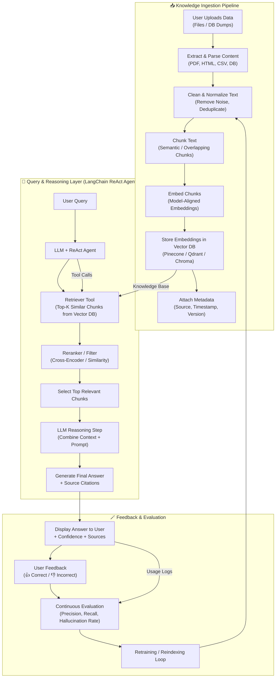
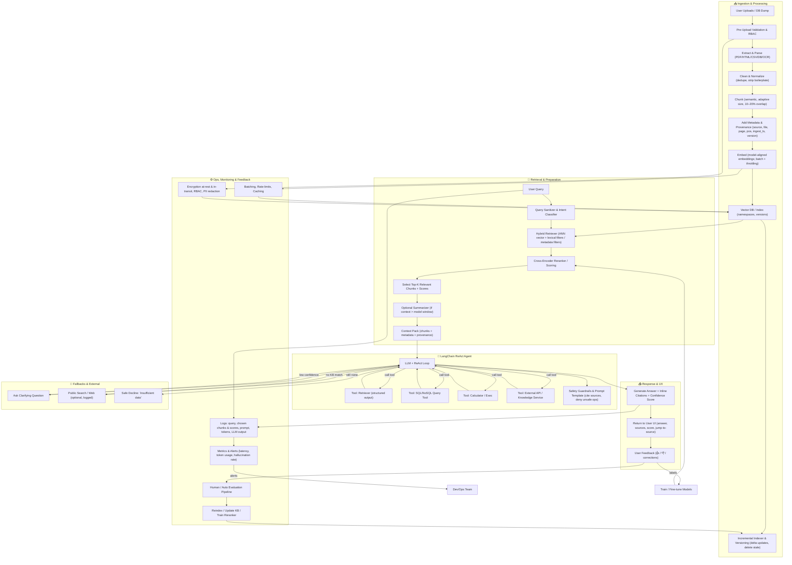

```mermaid
flowchart TD
    %% ===== Ingestion & Processing =====
    subgraph Ingestion["📥 Knowledge Ingestion Pipeline"]
        A["User Uploads Data<br>(Files / DB Dumps)"] --> B["Extract & Parse Content<br>(PDF, HTML, CSV, DB)"]
        B --> C["Clean & Normalize Text<br>(Remove Noise, Deduplicate)"]
        C --> D["Chunk Text<br>(Semantic / Overlapping Chunks)"]
        D --> E["Embed Chunks<br>(Model-Aligned Embeddings)"]
        E --> F["Store Embeddings in Vector DB<br>(Pinecone / Qdrant / Chroma)"]
        F --> G["Attach Metadata<br>(Source, Timestamp, Version)"]
    end

    %% ===== Retrieval & Reasoning =====
    subgraph Reasoning["🧠 Query & Reasoning Layer (LangChain ReAct Agent)"]
        H[User Query] --> I[LLM + ReAct Agent]
        I --> J["Retriever Tool<br>(Top-K Similar Chunks from Vector DB)"]
        J --> K["Reranker / Filter<br>(Cross-Encoder / Similarity)"]
        K --> L[Select Top Relevant Chunks]
        L --> M["LLM Reasoning Step<br>(Combine Context + Prompt)"]
        M --> N[Generate Final Answer<br>+ Source Citations]
    end

    %% ===== Monitoring & Feedback =====
    subgraph Feedback["🪄 Feedback & Evaluation"]
        N --> O[Display Answer to User<br>+ Confidence + Sources]
        O --> P["User Feedback<br>(👍 Correct / 👎 Incorrect)"]
        P --> Q["Continuous Evaluation<br>(Precision, Recall, Hallucination Rate)"]
        Q --> R[Retraining / Reindexing Loop]
        R --> C
    end

    %% ===== Flow Connections =====
    F -->|Knowledge Base| J
    I -->|Tool Calls| J
    O -->|Usage Logs| Q

```

```mermaid
flowchart TD
  %% ================= Ingestion & Processing =================
  subgraph ING["📥 Ingestion & Processing"]
    A["User Uploads / DB Dump"] --> A1["Pre-Upload Validation & RBAC"]
    A1 --> B["Extract & Parse (PDF/HTML/CSV/DB/OCR)"]
    B --> C["Clean & Normalize (dedupe, strip boilerplate)"]
    C --> D["Chunk (semantic, adaptive size, 10–20% overlap)"]
    D --> MD["Add Metadata & Provenance (source, file, page, pos, ingest_ts, version)"]
    MD --> E["Embed (model-aligned embeddings; batch + throttling)"]
    E --> F["Vector DB / Index (namespaces, versions)"]
    F --> GI["Incremental Indexer & Versioning (delta updates, delete stale)"]
  end

  %% ================= Retrieval & Prep =================
  subgraph RET["🔎 Retrieval & Preparation"]
    Q["User Query"] --> S1["Query Sanitizer & Intent Classifier"]
    S1 --> Hybrid["Hybrid Retriever (ANN vector + lexical filters / metadata filters)"]
    Hybrid --> Rerank["Cross-Encoder Reranker / Scoring"]
    Rerank --> TopK["Select Top-K Relevant Chunks + Scores"]
    TopK --> Summ["Optional Summarizer (if context > model window)"]
    Summ --> ContextPack["Context Pack (chunks + metadata + provenance)"]
  end

  %% ================= LangChain ReAct Agent & Tools =================
  subgraph AGENT["🧠 LangChain ReAct Agent"]
    ContextPack --> AgentCore["LLM + ReAct Loop"]
    AgentCore -->|call tool| Tool_Retriever["Tool: Retriever (structured output)"]
    AgentCore -->|call tool| Tool_DB["Tool: SQL/NoSQL Query Tool"]
    AgentCore -->|call tool| Tool_Calc["Tool: Calculator / Exec"]
    AgentCore -->|call tool| Tool_API["Tool: External API / Knowledge Service"]
    Tool_Retriever --> AgentCore
    Tool_DB --> AgentCore
    Tool_Calc --> AgentCore
    Tool_API --> AgentCore
    AgentCore --> Safety["Safety Guardrails & Prompt Template (cite sources, deny unsafe ops)"]
  end

  %% ================= Answering & UX =================
  subgraph OUT["📤 Response & UX"]
    AgentCore --> DraftAnswer["Generate Answer + Inline Citations + Confidence Score"]
    DraftAnswer --> ResponseUI["Return to User UI (answer, sources, score, jump-to-source)"]
    ResponseUI --> Feedback["User Feedback (👍 / 👎 / corrections)"]
  end

  %% ================= Monitoring, Feedback, Ops =================
  subgraph OPS["⚙️ Ops, Monitoring & Feedback"]
    Q --> Telemetry["Logs: query, chosen chunks & scores, prompt, tokens, LLM output"]
    DraftAnswer --> Telemetry
    Telemetry --> Observability["Metrics & Alerts (latency, token usage, hallucination rate)"]
    Feedback --> Eval["Human / Auto Evaluation Pipeline"]
    Eval --> ReindexTask["Reindex / Update KB / Train Reranker"]
    ReindexTask --> GI
    E --> CostControls["Batching, Rate-limits, Caching"]
    CostControls --> F
    A1 --> Security["Encryption at-rest & in-transit, RBAC, PII redaction"]
    Security --> F
  end

  %% ================= Fallbacks & External Search =================
  subgraph FALL["🔁 Fallbacks & External"]
    AgentCore -->|low confidence| Clarify["Ask Clarifying Question"]
    AgentCore -->|no KB match| PublicSearch["Public Search / Web (optional, logged)"]
    AgentCore -->|still none| SafeDecline["Safe Decline: 'insufficient data'"]
    PublicSearch --> AgentCore
    Clarify --> AgentCore
  end

  %% ================= Connections =================
  F --> Hybrid
  Observability -->|alerts| Team["Dev/Ops Team"]
  Feedback -->|labels| TrainingData["Train / Fine-tune Models"]
  TrainingData --> Rerank

```

```mermaid
flowchart LR
  %% Compact slide-ready RAG + ReAct pipeline
  U["User UI / Query"] --> Ingest["Ingest & Parse\n(PDF/DB/CSV)"]
  Ingest --> Clean["Clean / Chunk / Metadata"]
  Clean --> Embed["Embed (batch)"]
  Embed --> Index["Vector DB / Index\n(namespaces, versions)"]
  U --> Ask["Ask Agent (LangChain ReAct)"]
  Ask --> Retrieve["Hybrid Retriever\n(ANN + lexical)"]
  Retrieve --> Rerank["Reranker (cross-encoder)"]
  Rerank --> Context["Context Pack\n(chunks + metadata)"]
  Context --> Agent["LLM + ReAct\n(limited tools: retriever, SQL, calc, API)"]
  Agent --> Answer["Answer + Sources + Confidence"]
  Answer --> UIout["Return to UI\n(links → source)"]
  UIout --> Feedback["User Feedback / Flag"]
  Feedback --> Ops["Ops: Logs, Alerts, Reindex"]
  Agent -->|low confidence| Fallback["Fallback: Clarify / Public Search / Decline"]
  Index --> Retrieve
  style Ingest fill:#f8f9fa,stroke:#333,stroke-width:1
  style Agent fill:#fff7e6,stroke:#333,stroke-width:1

```