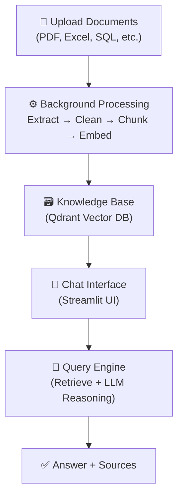
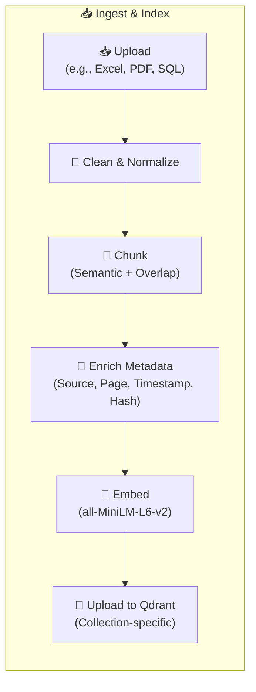
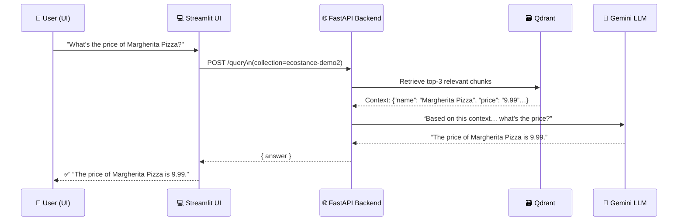
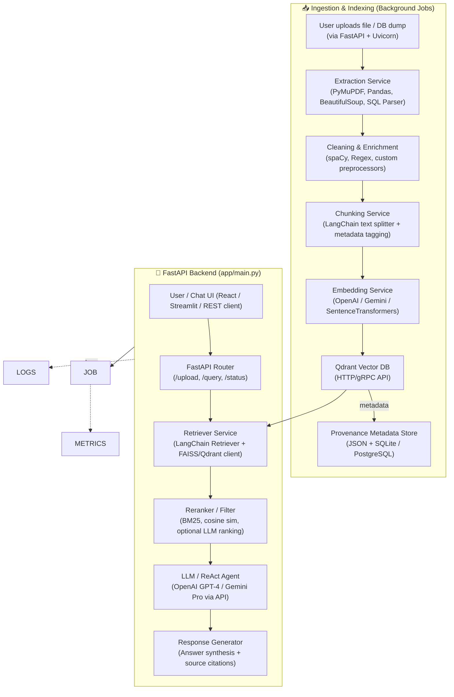
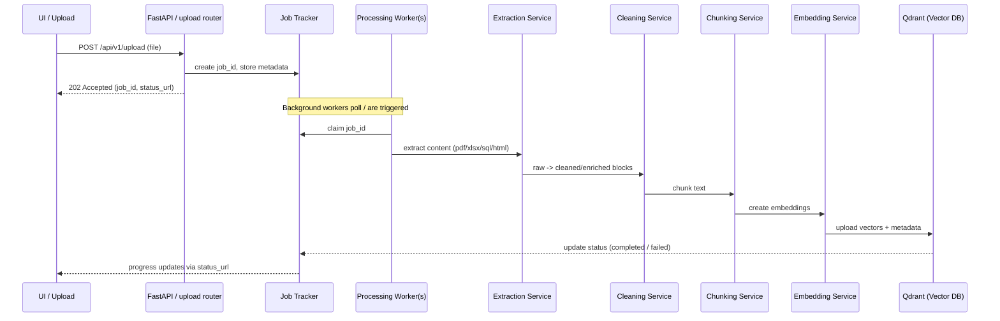
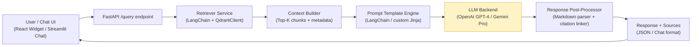

# 💡 EcoStance RAG Capabilities 
### System Capabilities Summary (Text Box for Slide)
* 📥 Multi-Format Ingestion (PDF, DOCX, Excel, CSV, SQL, HTML, JSONL, TXT, MD)
* 🧩 Intelligent Chunking (sentence-aware + 10–20% overlap)
* 🔍 Hybrid Retrieval (Qdrant ANN + metadata filtering)
* 🧠 Stateful Chat (chat history, follow-ups, context tracking)
* 🗂️ File-Level Management (delete/reindex individual files)
* ⚙️ Background Processing (non-blocking, job IDs, progress tracking)
* 🧾 Transparent Sourcing (source filename, table, extraction method)
* 🚀 Scalable (clean async pipeline, cleanup service, health checks)

## High-Level End-to-End RAG Architecture

##  Document Ingestion Pipeline (Processing Stages)

## Query & Response Workflow (Stateful RAG)

## System Architecture (with Tech Stack)

## Ingestion & Background Processing 

## Query / Retrieval Pipeline (LLM + RAG Stack)

