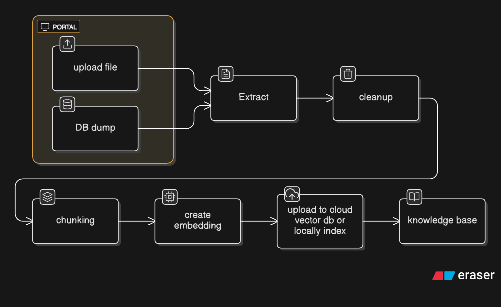
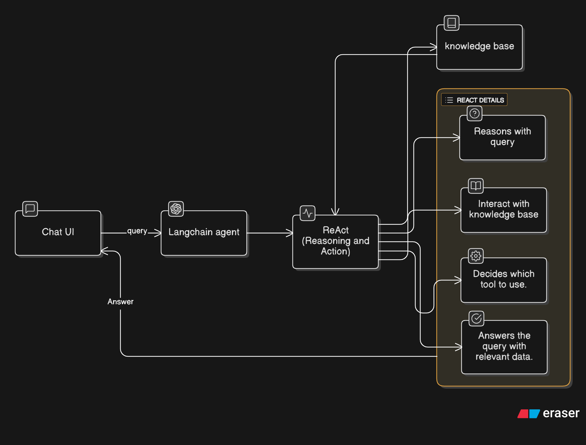
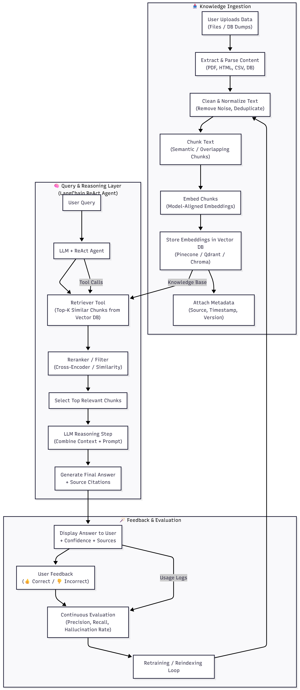

# Context aware RAG

### ⚙️ **Stage 1: Knowledge Ingestion**
**Portal → Extract → Chunk → Embed → Upload**

1. **Portal**
    - User uploads files or a database dump.
    - This is your entry point for knowledge ingestion.

2. **Extract**
    - Extracts text/data from uploaded files or DB dumps.
    - There’s a _cleanup_ step after extraction (to remove junk, normalize text, etc.).

3. **Chunking**
    - Splits the cleaned text into smaller “chunks” (e.g., paragraphs or semantic units).

4. **Create Embeddings**
    - Each chunk is converted into an embedding vector (numerical representation).

5. **Upload to Cloud Vector DB / Local Index**
    - Embeddings are stored in a **vector database** (like Pinecone, Qdrant, or Chroma) or a **local index**.
    - This forms your **Knowledge Base**.

   

### 🧠 **Stage 2: Reasoning and Query Handling (ReAct Loop)**
**Chatbot / LLM → ReAct → Knowledge Base**

1. **Chatbot receives a query** from the user.
2. The **ReAct module (Reasoning + Action)** does a few things:
    - **Reasons with query** (interprets intent, figures out context).
    - **Decides which tool to use** (maybe DB lookup, external API, or knowledge base retrieval).
    - **Interacts with Knowledge Base** (fetches relevant data from embeddings).

3. **Knowledge Base** returns **context chunks**.
4. **ReAct answers the query** using the retrieved data.
    - Possibly adds reasoning steps or chain-of-thought-style actions to improve the answer.

# Improvements
**Metadata & provenance on every chunk**
    - Attach: source filename, original doc position (page/par), ingest timestamp, doc-type, confidence, and version.
    - This enables exact citations, source filtering, and debugging when the agent hallucinates.

**Chunking strategy: semantic + overlap**
  - Use content-aware (sentence/paragraph) chunking with ~100–600 tokens depending on model and retrieval context size.
  - Add 10–20% overlap so answers don’t lose context between chunks.

**Cleaner extraction pipeline**
    - File-specific extractors: PDF text + OCR fallback, HTML scrapers (strip nav), CSV/DB normalizers.
    - Normalization: remove boilerplate, deduplicate, and normalize whitespace/encodings before chunking.

**Embeddings & vector DB choices**
    - Use embeddings that match your LLM (semantically aligned). Test 2–3 options for retrieval quality.
    - Choose a vector DB with: namespaces, metadata filter support, ANN speed, and persistence (Qdrant/Pinecone/Weaviate/Chroma).
    - Enable hybrid search (embedding + lexical) for short/keyword-y queries.

**Retrieval: use a reranker**
    - Retrieve top-k embeddings, then rerank with an instruction-tuned model or cross-encoder for precision before passing to LLM.
    - This reduces irrelevant context and token waste.

